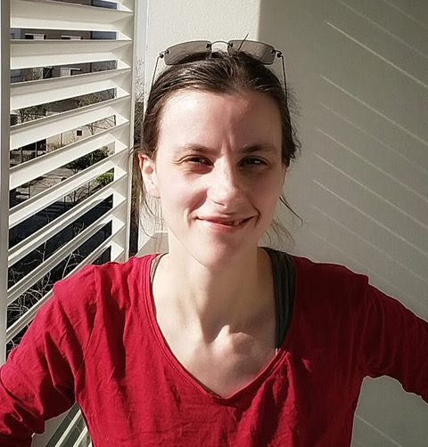
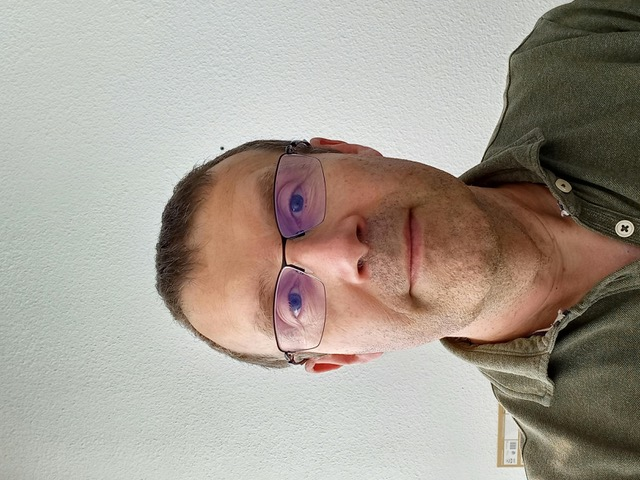
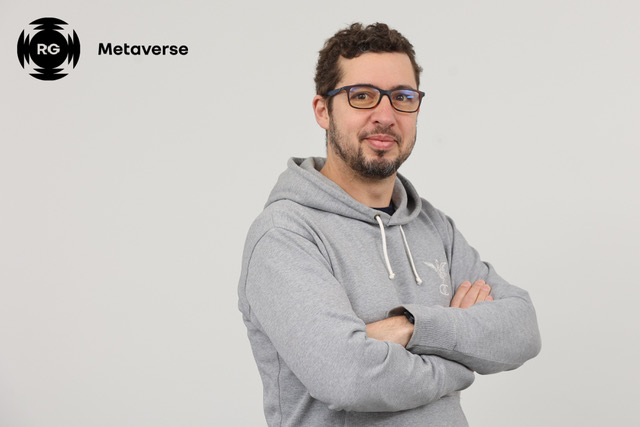
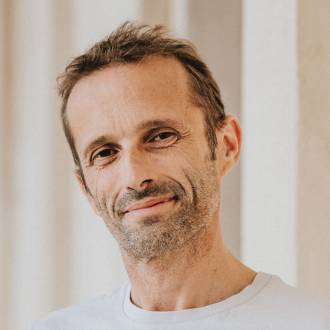
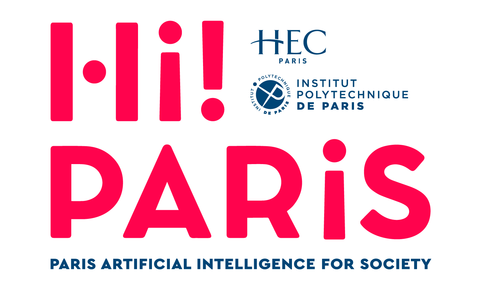
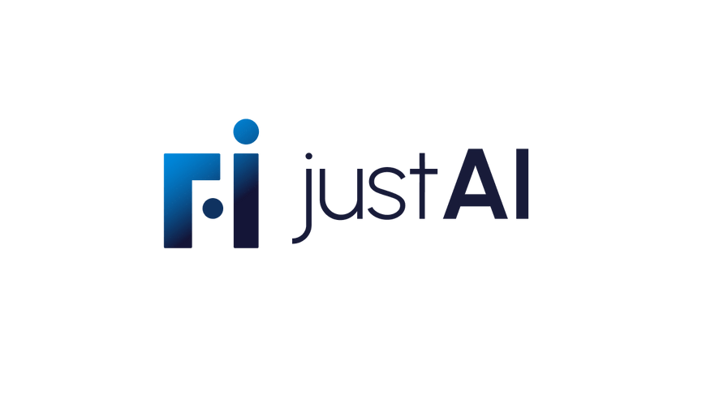
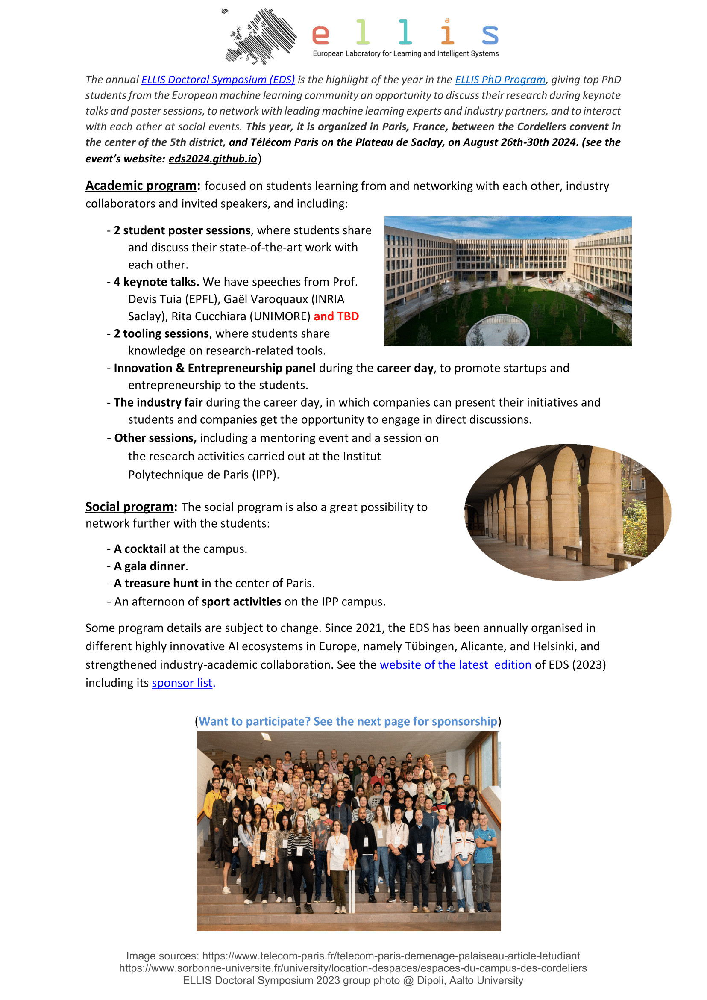
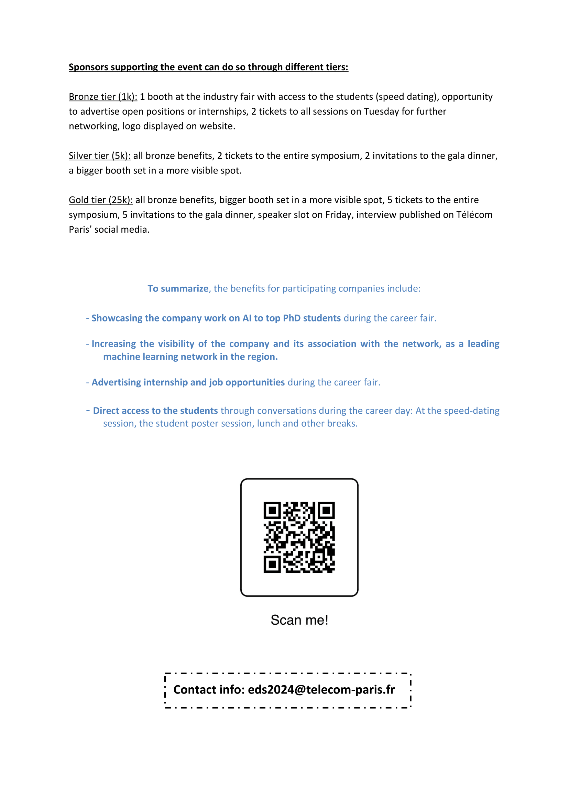

<head>
    
</head>

<body>
    

        

            
            

                    <h2>Aurélie Boisbunon</h2>
                
Aurélie Boisbunon is currently a Data Researcher at Ericsson R&D Center France. She is also a reviewer at the following machine learning international conferences: NeurIPS, ICML, and ICLR. Before that, she was a Senior Data Scientist and Researcher for over 2 years at MyDataModels, a startup that offers a WebApp for Data Analytics and Machine Learning, and an R&D engineer at Engie Ineo for 4 years. She also completed a postdoc in Statistics and Image Processing sponsored by CNES and l’INRIA with Josiane Zerubia, as well as a 6-month postdoc in Statistics at the University of Tokyo (Japan) with Yuzo Maruyama. She obtained her PhD at Université de Rouen (France), under the supervision of Stéphane Canu and Dominique Fourdrinier. 

            

        

        

            
            

                    <h2>Bruno Carron</h2>
                
Bruno Carron is an engineer and senior expert in artificial intelligence (AI) at Airbus Defence and Space. Dealing with Intelligence systems, Bruno Carron has been appointed as technical coordinator in the AI4DEF consortium. It is an opportunity to implement advanced data processing techniques and to assess the use of AI in this military context by the mean of the Concept Design and Experimentation.
He has played a significant role in examining the ethical and responsible use of AI in military applications, particularly for the Future Combat Air System (FCAS) project. 

            

        

        

            
            

                    <h2>Vincent Feuillard</h2>
                
Vincent Feuillard is Expert in Data Science and Machine Learning at Renault Group. After earning his PhD in Statistical Learning from the CEA, he joined Airbus’ research center. For 10 years, he conducted and led research focused first on uncertainty propagation in computer experiments, then on developing advanced algorithms for predictive maintenance. He later joined the ACCOR Group, where he led a team of Data Scientists primarily working on Revenue Management and Customer Feedback Analysis challenges. In 2020, he joined Renault Group within the Metaverse Quality & Industry division, where he develops AI roadmaps and creates methods and tools to improve the group’s operational performance. His main activities include incident analysis using statistical methods and customer feedback analysis through the use and adaptation of language models (LM). Throughout his career, he has maintained close ties with the academic community by leading research projects, supervising PhD theses, and teaching. He is also an attached professor at the University of Paris-Saclay. 

            

        

        

            
            

                    <h2>Patrick Pérez</h2>
                
Patrick Pérez is CEO at Kyutai, a non-profit open-science AI lab, based in Paris. Prior to this, Patrick was at Valeo as VP of AI and Scientific Director of valeo.ai (2018-2023), and with Technicolor (2009-2018), Inria (1993-2000, 2004-2009) and Microsoft Research Cambridge (2000-2004) as research scientist. His research interests lie in reliable multimodal AI for the benefit of all. 

            

        

        

            
            

                    <h2>Piotr Sankowski</h2>
                
Piotr Sankowski is a professor at the Institute of Informatics, University of Warsaw, where he received his habilitation in 2009 and where he received a doctorate in computer science in 2005. His research interest focuses on practical application of algorithms, ranging from economic applications, through learning data structures, to parallel algorithms for data science. In 2009, Piotr Sankowski received also a doctorate in physics in the field of solid state theory at the Polish Academy of Sciences. In 2010 he received ERC Starting Independent Researcher Grant, in 2015 ERC Proof of Concept Grant, and in 2017 ERC Consolidator Grant. He is a president of IDEAS NCBR – a research and development centre operating in the field of artificial intelligence and digital economy. Piotr Sankowski is also a co-founder of the spin-off company MIM Solutions. 

            

        

    

    

        
        
        
        
        
        
        
        
        
    

</body>

<!---->

