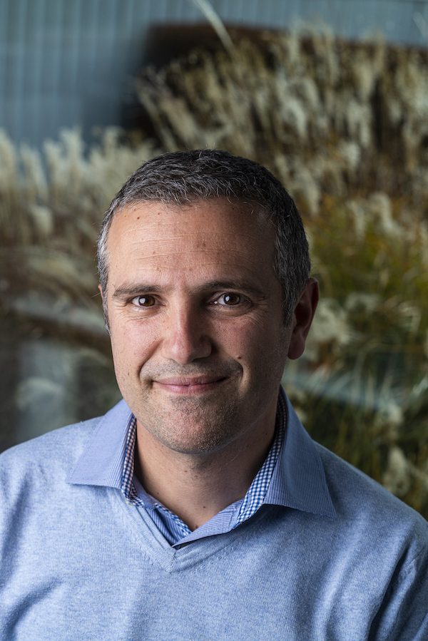
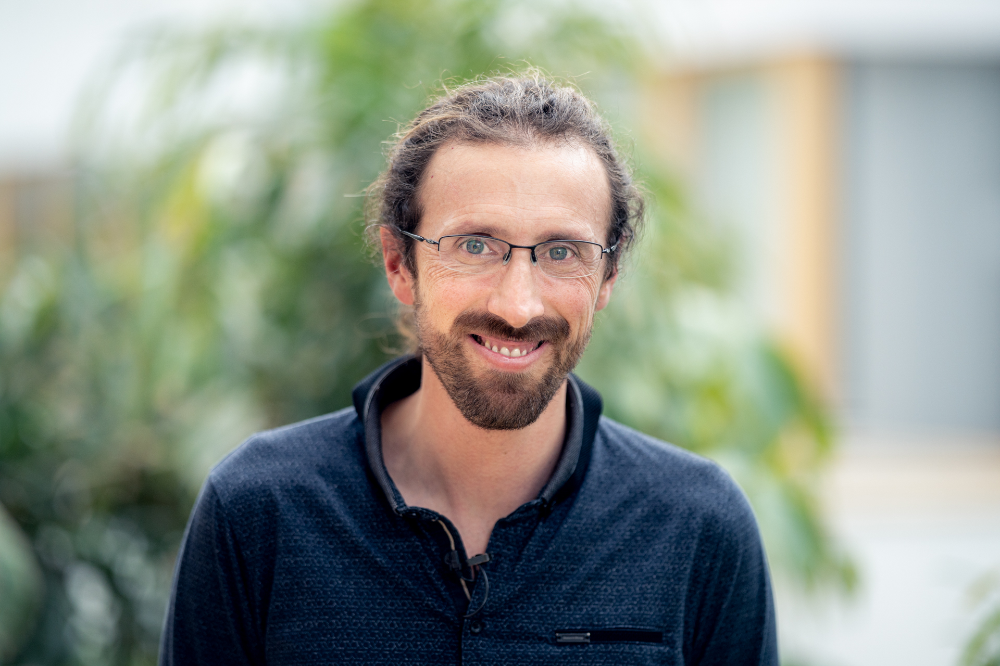
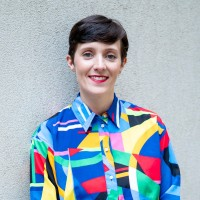

<head>
    <meta charset="UTF-8">
    <meta name="viewport" content="width=device-width, initial-scale=1.0">
    <title>Keynote Speakers</title>
    
</head>
Below are the speakers who confirmed their participation in EDS2024.

<body>
    

    

        
        

            <a href="https://aimagelab.ing.unimore.it/imagelab/person.asp?idpersona=1">
                <!-- <h2>Rita Cucchiara </h2> -->
                <h2>Rita Cucchiara (Università degli Studi di Modena e Reggio Emilia)</h2>
                <!-- <h2> Rita Cucchiara -->
            </a>
            
<strong>Title of the keynote: Learning, Unlearning, and Relearning.</strong>

            
Abstract: The concept of "Learning, Unlearning, and Relearning" encapsulates a dynamic approach to knowledge acquisition and adaptation, crucial for both human cognition and artificial intelligence systems. Learning involves acquiring new information or skills, while unlearning refers to the process of discarding outdated or erroneous knowledge, and relearning entails reacquiring knowledge in a new or updated form. This process is not merely about forgetting but about restructuring understanding to accommodate new insights and perspectives.
In machine learning and computer vision, unlearning presents unique challenges and opportunities. Machine unlearning refers to the ability to remove specific data from a model without degrading its overall performance. This capability is essential for addressing legal, ethical, and personalization issues. Techniques for unlearning in AI include the removal of data points, features, classes, or entire concepts from datasets. These methods aim to maintain model utility while ensuring the elimination of unwanted or harmful knowledge.
Emerging methods in machine unlearning, such as weight filtering and low-rank class-wise unlearning, demonstrate promising results in maintaining model integrity while achieving desired unlearning outcomes. These techniques are evaluated through various metrics, including accuracy retention, activation distance, and Zero Retain Forgetting (ZRF) scores. Additionally, unlearning in multimodal spaces addresses the removal of sensitive or inappropriate content, enhancing the safety and ethical alignment of AI systems.
The exploration of unlearning, especially in AI, paves the way for more robust, adaptable, and ethically sound models, capable of evolving in response to new data and societal norms. This ongoing research underscores the importance of unlearning and relearning as foundational components of both human and artificial intelligence development. During the seminar,  some results carried out at UNIMORE within the EU project ELIAS will be presented and discussed.

        

    

    

        
        

            <a href="https://people.epfl.ch/devis.tuia">
                <!-- <h2>Devis Tuia</h2> -->
                <h2>Devis Tuia (EPFL)</h2>
            </a>
            
<strong>Machine learning for Earth: monitoring the pulse of our Planet with sensor data, from your phone all the way to space</strong>

            
Abstract: We live an age full of data. In all areas of society, digital data is now abundant, but also unstructured and pretty much unexploited. Environmental science is no exception and the last years have seen an increase of use of digital sensing to observe an understand processes at work and their impacts of human activities. In this talk, I will present some recent research at the interface of machine learning and the geosciences, where satellite, drone and close sensing data were used to support mapping over land and sea, and even below the surface. I will then sketch a number of points of synergetic action necessary to strengthen such interface, a necessary step to jointly tackling the climate and biodiversity crisis.

        

    

        

            
            

                <a href="https://gael-varoquaux.info/">
                    <!-- <h2>Gaël Varoquaux</h2> -->
                    <h2>Gaël Varoquaux (Inria Saclay)</h2>
                </a>
                
<strong>Title of the keynote: AI from tabular data to healthcare and society.</strong>

                
Abstract: I will talk about some lessons learned trying to develop AI for tabular data, central to all organizations, with the goal of being useful for healthcare and society. While much of the excitement is on machine learning, much of the work happens before and after. For tabular data, the bread and butter of every organization, extensive manual transformation or "data wrangling" is required before machine learning. I will discuss how we progressively rethought this process, eventually laying the ground of foundation models for tabular data. I will then discuss some considerations about machine learning in healthcare, and a broader picture on AI developments in society.

            

        

        

    

        
        

            <a href="https://davidrolnick.com/">
                <!-- <h2>David Rolnick </h2> -->
                <h2>David Rolnick (McGill University and Mila – Quebec AI Institute)</h2>
            </a>
            
<strong>Title of the keynote: Tackling climate change with machine learning: An opportunity for application-driven innovation.</strong>

            
Abstract: Machine learning is increasingly being called upon to help address climate change, from processing satellite imagery to modeling Earth systems. Such settings represent an important frontier for machine learning innovation, where traditional paradigms of large, general-purpose datasets and models often fall short. In this talk, we show how an application-driven paradigm for algorithm design can respond to problem-specific goals and incorporate relevant domain knowledge. We introduce novel techniques that leverage the structure of the problem (such as physical constraints and multi-modal self-supervision) to improve accuracy and usability across applications, including monitoring land use with remote sensing, designing chemical catalysts for the energy transition, and downscaling climate data. 

        

    

        

            
            

                <a href="https://theallyance.one/team">
                    <!-- <h2>Caroline Therwath-Chavier</h2> -->
                    <h2>Caroline Therwath-Chavier (The Allyance)</h2>
                </a>
                
<strong>AI²: why Artificial Intelligence should be All Inclusive.</strong>

                
Abstract: In today’s rapidly evolving technological landscape, the transformative potential of Artificial Intelligence (AI) is undeniable. However, as AI continues to revolutionize various industries and aspects of our lives, questions of inclusivity and equity have come to the forefront for practitioners. This presentation delves into the imperative of making AI all-inclusive, ensuring that its benefits are accessible to all segments of society.
                We will explore the ethical, social, and economic implications of AI exclusivity, emphasizing the need for diverse representation in AI development and deployment. Through case studies and real-world examples, we will highlight the tangible benefits of inclusive AI, from enhancing decision-making processes to fostering innovation and creativity.
                Moreover, the presentation will address the challenges and barriers to achieving inclusivity in AI, including biases in algorithms, lack of diversity in AI teams, and digital divides. By identifying these obstacles, we can formulate strategies to overcome them and create a more equitable AI ecosystem.
Ultimately, AI² advocates for a future where Artificial Intelligence is not only powerful and innovative but also inclusive and accessible to everyone. By embracing diversity and promoting inclusion, we can harness the full potential of AI to address pressing societal challenges and build a better world for all.
         

<em>Caroline is also the co-founder of <a href="https://www.meetup.com/fr-FR/Paris-Women-in-Machine-Learning-Data-Science/">the Paris meetup chapter of Women in Machine Learning and Data Science (WiMLDS)</a>, click on the link for more information.</em>

            

        

    

<!-- </body> -->
