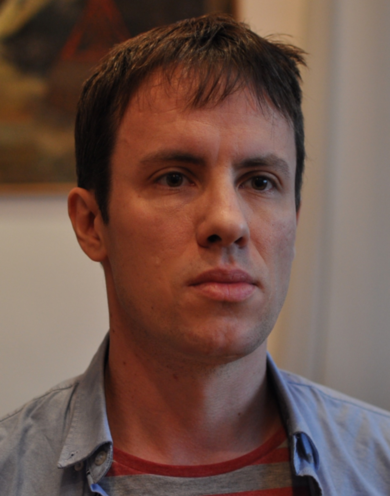
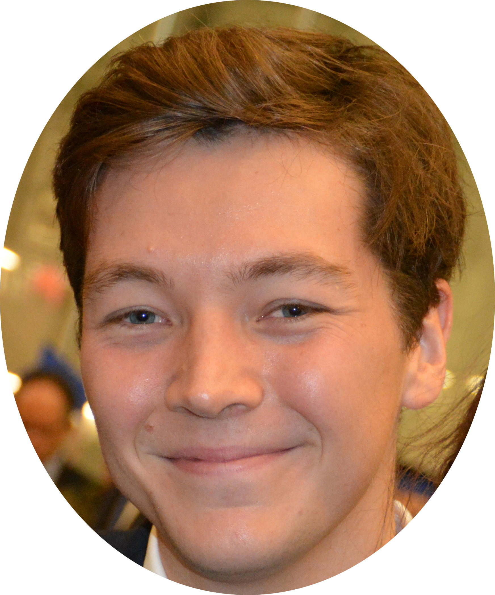
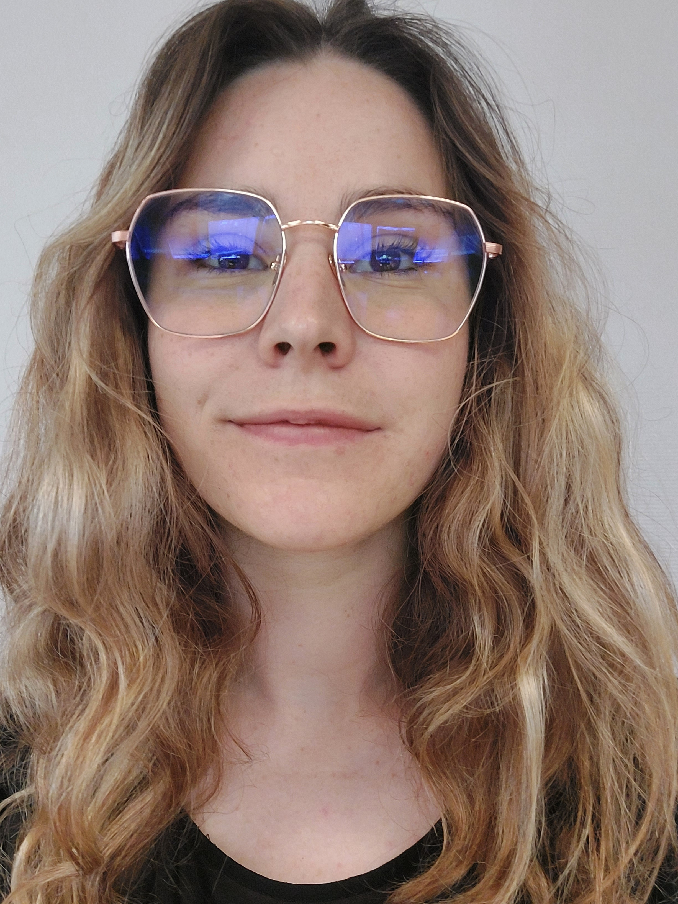
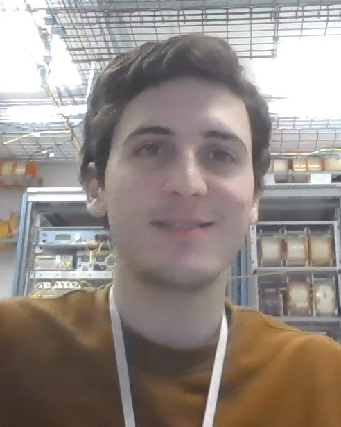
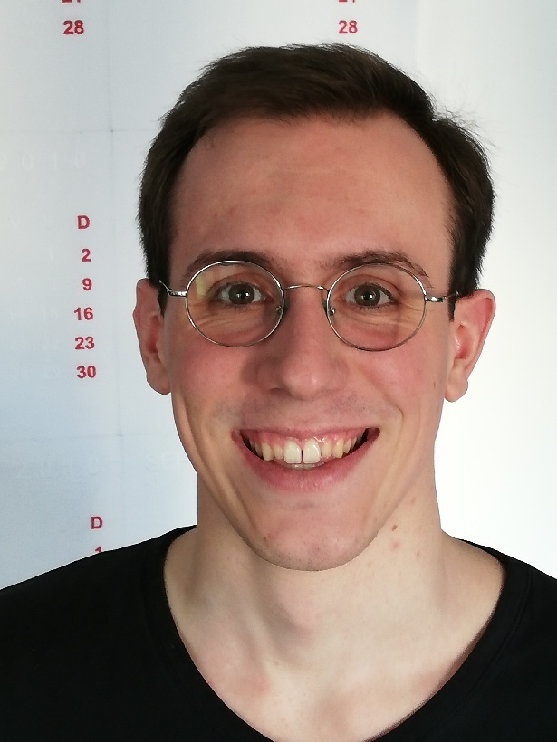
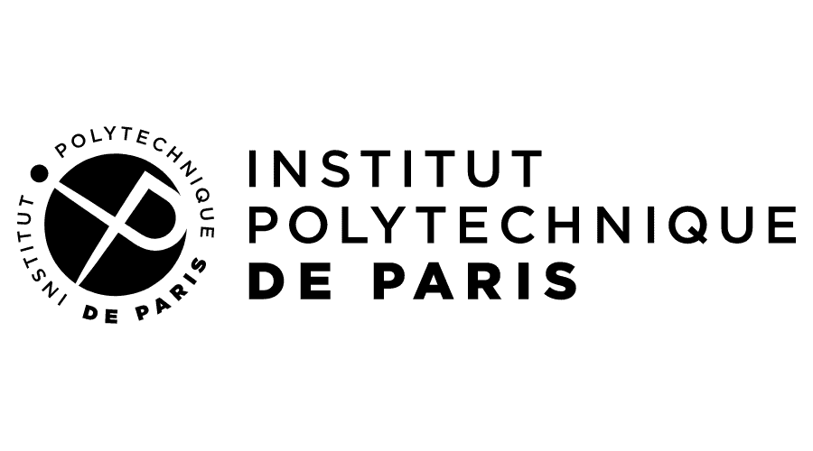

<head>
    <meta charset="UTF-8">
    <meta name="viewport" content="width=device-width, initial-scale=1.0">
    <title>Organisers</title>
    
</head>
<body>
    
 The event is organised by the <a href="https://www.ip-paris.fr/en">Institut Polytechnique de Paris (IPP)</a> with support from the <a href="https://www.uva.nl/en">University of Amsterdam</a> (<a href="https://www.elise-ai.eu">ELISE</a>), <a href="https://ellis.eu/">ELLIS</a> and <a href="https://www.elsa-ai.eu/">ELSA</a>. 

<body>
<h2>Organising Committee</h2>

        <a href="">
            
            
Charlotte Delage

        </a>
            
Scientific Coordinator

            
Télécom Paris

    

        <a href="">
            
            
Lynn Anthonissen

        </a>
            
Scientific Coordinator

            
University of Tübingen

    

        <a href="">
            
            
Adela Pranindiati

        </a>
            
Industry Coordinator

            
University of Amsterdam

    

<h2>Scientific Committee</h2>

        <a href="http://www.gpeyre.com">
            
            
Gabriel Peyré

        </a>
            
Unit Director ELLIS Paris

            
ENS, CNRS

            

    

        <a href="http://remi.flamary.com">
            
            
Rémi Flamary

        </a>
            
Full Professor

            
École Polytechnique

    

        <a href="http://www.cmapx.polytechnique.fr/~karim.lounici/">
            
            
Karim Lounici

        </a>
            
Full Professor

            
École Polytechnique

    

        <a href="https://perso.telecom-paristech.fr/fdalche/">
            
            
Florence d'Alché-Buc

        </a>
            
Full Professor

            
Télécom Paris

    

        <a href="https://enzotarta.github.io">
            
            
Enzo Tartaglione

        </a>
            
Associate Professor

            
Télécom Paris

    

        <a href="https://laclauc.github.io">
            
            
Charlotte Laclau

        </a>
            
Associate Professor

            
Télécom Paris

    

        <a href="">
            
            
Matthieu Labeau

        </a>
            
Associate Professor

            
Télécom Paris

    

        <a href="https://ekhiru.github.io">
            
            
Ekhine Irurozki

        </a>
            
Associate Professor

            
Télécom Paris

    

<h2>Postdoc & PhD Support Group</h2>

        <a href="https://ainagari.github.io">
            
            
Aina Garí Soler

        </a>
            
Postdoc

            
Télécom Paris

    

        <a href="https://qbouniot.github.io">
            
            
Quentin Bouniot

        </a>
            
Postdoc

            
Télécom Paris

    

        <a href="">
            
            
Mathilde Perez

        </a>
            
PhD Student

            
Télécom Paris

    

        <a href="">
            
            
Isaia Andrenacci

        </a>
            
PhD Student

            
Télécom Paris

    

        <a href="">
            
            
Victor Quétu

        </a>
            
PhD Student

            
Télécom Paris

    

        <a href="">
            
            
Grégoire Pacreau

        </a>
            
PhD Student

            
École Polytechnique

    

        <a href="https://tgnassou.github.io">
            
            
Théo Gnassounou

        </a>
            
PhD Student

            
Université Paris-Saclay

    

</body>

    
    
    

